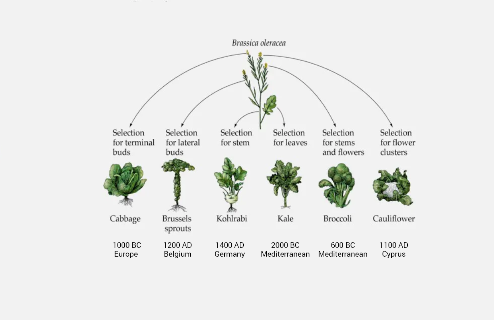
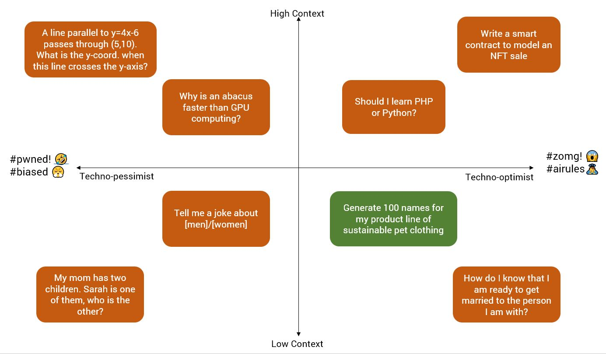
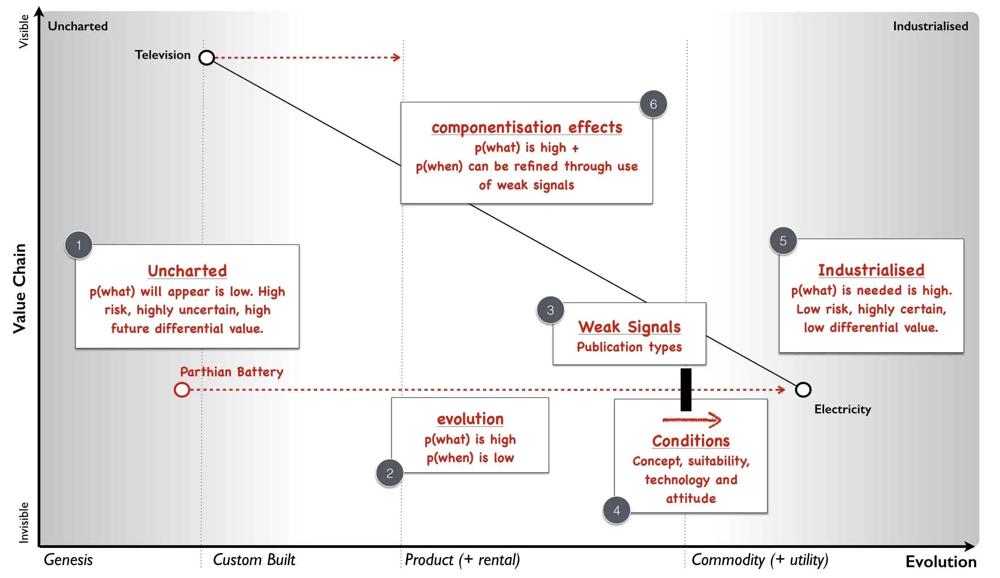
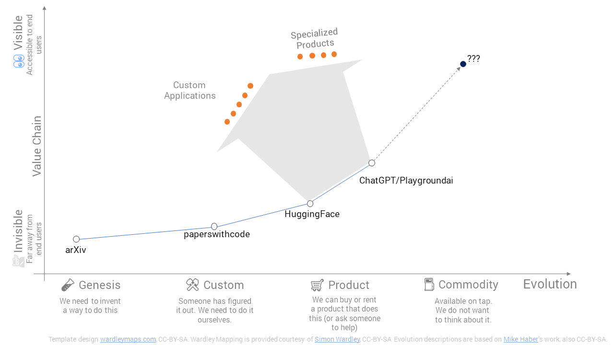

# Brassica Oleracea

Brassica Oleracea could be called a weed. It grows in the wild, primarily in the Mediterranean on exposed limestone cliffs, largely unremarkable except for its tiny yellow flowers which bloom over the summer.
Over 3 centuries ago, humankind first domesticated this plant, and over time, through the magic of artificial selection, we now have a variety of edible "vegetables" - cabbages, cauliflower, kale, broccoli and much more.
This transformation took over 2000 years starting with the earliest cabbages in 1000 BC to the modern day kohlrabi around 1400 AD.

Brassica Oleracea could be called a weed. It grows in the wild, primarily in the Mediterranean on exposed limestone cliffs, largely unremarkable except for its tiny yellow flowers which bloom over the summer.
Over 3 centuries ago, humankind first domesticated this plant, and over time, through the magic of artificial selection, we now have a variety of edible "vegetables" - cabbages, cauliflower, kale, broccoli and much more.
This transformation took over 2000 years starting with the earliest cabbages in 1000 BC to the modern day kohlrabi around 1400 AD.

# Reading the Cabbage Leaves

What does any of this have to do with Generative AI?

I posted this a few days ago on what I thought ChatGPT was good for, as of today vs what was being asked of it by an audience of individual users.  

  

I don't think anyone doubts that many of the orange boxes in the picture above will turn green over time.  

In fact LinkedIn is already rife with content of the form  
*"ChatGPT is exciting. But do you know of these [10/20/50] AI tools that exist today?"*

But HOW do we get from here to there?  

# The How

## WardleyMaps

[Simon Wardley](https://www.linkedin.com/in/simonwardley)'s Wardley Maps (HT: [Prasanna Krishnamoorthy](https://www.linkedin.com/in/prasannainindia) for popularizing) give us a useful framework to think about the How.

The two broad postulates here are:

- **Left to Right Drift:** Tech drifts from left to right from being an idea to customized installation to commodity/utility

- **Bottom Right drives Top Left:** Tech that is on the bottom right leads to a new layer of tech which is more customer facing/customer friendly which in turn drifts rightwardvv

## The World of NLP is giving

The NLU / NLP complex has evolved incredibly rapidly over the past decade. When I started my journey with NLP, Latent Semantic Analysis was in vogue.  

This quickly gave way to Word Embeddings (Word2Vec/GloVe/FastText) and the era of Transformers following ["Attention is All You Need"](https://arxiv.org/abs/1706.03762)

On the user facing front we've had a series of access barriers torn down aiding rapid progress:

- want to learn? here is accessible scientific literature (arXiv)
- want to build your own? here is code (paperswithcode/github)
- want to use an existing model? here are usable implementations ( HuggingFace);  
and finally
- want a ready to use application? here you go (ChatGPT / PlaygroundAI)

At this point I am going to use a WardleyMap to explain my thinking on what happens next:  

## Part 1: Custom Applications
A number of organizations will consume Generative AI APIs / train their own models to create new custom applications.   
There are a number of low cost of error/high volume intelligent automation use cases that can be tackled here.

## Part 2: Specialized Products
Existing software products will start to offer an enhanced version or tier that includes Generative AI embedded capabilities.   
Customer response will dictate how these evolve.   

## Part 3: Evolution of Core Product

ChatGPT has been free, in my opinion, not to accumulate millions of free users but to be able to use all these queries to model accurately / productify what paid users might want from them (and to understand if simpler/lighter models can deliver that).   
To this end we will see Generative AI models evolve and get more sophisticated over time and deliver much more than what it does today right out of the box.  

# Democratized Access => Cauliflowers come sooner   
Cabbages and cauliflowers were the result of enterprising individuals experimenting with a wild ancestor.
Generative AI today, similarly has accessible, low cost primitives, waiting to be experimented with, not unlike *brassica oleracea* growing on the limestone cliffs of the Mediterranean all those years ago.  

This time, hopefully, we won't have to wait for 2000 years to get cauliflowers.  